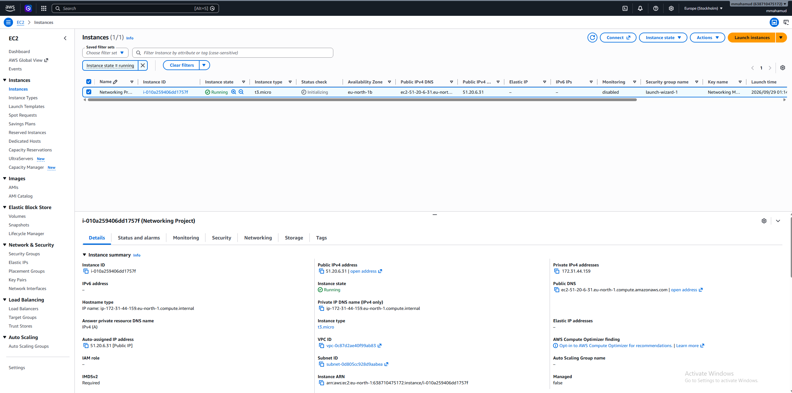

# Networking Project - EC2, NGINX, DNS & HTTPS

## Project Overview

In this project, I deployed an NGINX web server on an Ubuntu AWS EC2 instance and made it publicly accessible through my own custom domain.

I configured Cloudflare DNS with an A record to map my domain name to the public IPv4 address of my EC2 instance. I also configured the EC2 security group to allow SSH, HTTP and HTTPS traffic and secured the website using TLS with Certbot and Let's Encrypt.

The purpose of this project was to put my networking knowledge into practice and understand how DNS, IP addresses, ports, security groups, EC2, NGINX, HTTP and HTTPS work together when a user accesses a website.

## Architecture

The project follows this flow:

                    User
                      |
                      | https://mmahamud.com
                      v
               Cloudflare DNS
                      |
                      | A Record
                      v
               EC2 Public IPv4
                      |
                      v
              Security Group
                /         \
          HTTP :80      HTTPS :443
              |             |
              |             v
              |           NGINX
              |             |
              |             v
              +------> Web Page

When a user enters my domain name, DNS resolves the domain to the public IPv4 address of my EC2 instance.

The browser then connects to the EC2 instance. The AWS Security Group controls which ports are accessible. HTTP traffic on port 80 is redirected to HTTPS, while HTTPS traffic uses port 443.

NGINX listens for web requests and serves the webpage back to the user's browser.

## EC2 Setup

I created an AWS EC2 instance running Ubuntu Server to host the NGINX web server.

An EC2 instance is a virtual machine running on AWS infrastructure. The instance was assigned a public IPv4 address, allowing it to be reached over the internet.

I created a key pair during the instance setup so that I could securely connect to the server using SSH.

### EC2 Instance

## Security Group Configuration

I configured the EC2 Security Group to control which inbound traffic was allowed to reach my server.

The following inbound rules were configured:

- **SSH (Port 22)** — Restricted to my public IP for secure administrative access to the EC2 instance.
- **HTTP (Port 80)** — Allowed from `0.0.0.0/0` so that users can access the website over HTTP.
- **HTTPS (Port 443)** — Allowed from `0.0.0.0/0` so that users can securely access the website over HTTPS.

Port 22 was restricted because SSH provides administrative access to the server, whereas ports 80 and 443 need to be publicly accessible for web traffic.

This helped me understand how security groups act as virtual firewalls for EC2 instances by controlling which traffic is allowed to reach the server.

### Security Group Inbound Rules

