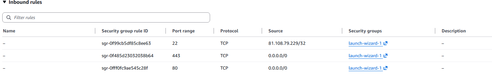
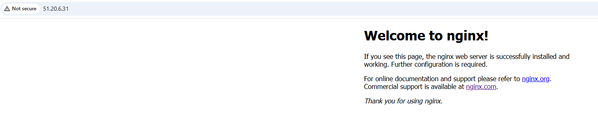
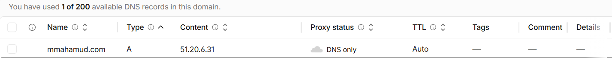
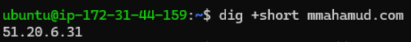
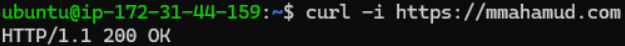
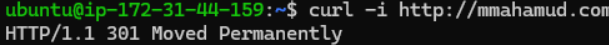

# Networking Project - EC2, NGINX, DNS & HTTPS

## Project Overview

In this project, I deployed an NGINX web server on an Ubuntu AWS EC2 instance and made it publicly accessible through my own custom domain.

I configured Cloudflare DNS with an A record to map my domain name to the public IPv4 address of my EC2 instance. I also configured the EC2 security group to allow SSH, HTTP and HTTPS traffic and secured the website using TLS with Certbot and Let's Encrypt.

The purpose of this project was to put my networking knowledge into practice and understand how DNS, IP addresses, ports, security groups, EC2, NGINX, HTTP and HTTPS work together when a user accesses a website.


## Architecture

The project follows this flow:

                    User
                      |
                      | https://mmahamud.com
                      v
               Cloudflare DNS
                      |
                      | A Record
                      v
               EC2 Public IPv4
                      |
                      v
              Security Group
                /         \
          HTTP :80      HTTPS :443
              |             |
              |             v
              |           NGINX
              |             |
              |             v
              +------> Web Page

When a user enters my domain name, DNS resolves the domain to the public IPv4 address of my EC2 instance.

The browser then connects to the EC2 instance. The AWS Security Group controls which ports are accessible. HTTP traffic on port 80 is redirected to HTTPS, while HTTPS traffic uses port 443.

NGINX listens for web requests and serves the webpage back to the user's browser.

## EC2 Setup

I created an AWS EC2 instance running Ubuntu Server to host the NGINX web server.

An EC2 instance is a virtual machine running on AWS infrastructure. The instance was assigned a public IPv4 address, allowing it to be reached over the internet.

I created a key pair during the instance setup so that I could securely connect to the server using SSH.

### EC2 Instance


## Security Group Configuration

I configured the EC2 Security Group to control which inbound traffic was allowed to reach my server.

The following inbound rules were configured:

- **SSH (Port 22)** — Restricted to my public IP for secure administrative access to the EC2 instance.
- **HTTP (Port 80)** — Allowed from `0.0.0.0/0` so that users can access the website over HTTP.
- **HTTPS (Port 443)** — Allowed from `0.0.0.0/0` so that users can securely access the website over HTTPS.

Port 22 was restricted because SSH provides administrative access to the server, whereas ports 80 and 443 need to be publicly accessible for web traffic.

This helped me understand how security groups act as virtual firewalls for EC2 instances by controlling which traffic is allowed to reach the server.

### Security Group Inbound Rules




## Connecting to EC2 Using SSH

After launching the EC2 instance, I connected to the Ubuntu server remotely using SSH.

I first restricted the permissions of my private key:

```bash
chmod 400 networking-module.pem
```
I then connected to the EC2 instance using:
```
ssh -i networking-module.pem ubuntu@ec2-xx-xx-xx-xx.eu-west-1.compute.amazonaws.com
```
-> **Security Note:** I have intentionally not included my `.pem` private key in this repository because it contains sensitive authentication credentials.

## Installing NGINX

After connecting to the EC2 instance through SSH, I updated Ubuntu's package list:

```bash
sudo apt update
```
I then installed NGINX:

```bash
sudo apt install nginx -y
```

NGINX is the web server used in this project. It listens for incoming web requests and sends the requested web content back to the user's browser.
I verified that NGINX was running using:

```
systemctl status nginx
```

### Testing NGINX
Before configuring my domain, I tested the web server directly using the EC2 instance's public IPv4 address. The default **Welcome to nginx!** page loaded successfully.
This confirmed that:
- The EC2 instance was reachable over the internet.
- NGINX was running successfully.
- Port 80 was accessible.
- The security group was allowing HTTP traffic to reach the server.




## DNS Configuration

After confirming that the NGINX web server was accessible through the EC2 public IP address, I configured my custom domain using Cloudflare DNS.

I created an **A record** with the following configuration:

- **Type:** A
- **Name:** `@`
- **IPv4 address:** EC2 public IPv4 address
- **Proxy status:** DNS only
- **TTL:** Auto

An A record maps a domain name to an IPv4 address. In my case, `mmahamud.com` points to the public IPv4 address of my EC2 instance.

This allows users to access the web server using:

```text
mmahamud.com
```
instead of having to remember the EC2 public IP address.

### Cloudflare DNS Record



## Verifying DNS

After configuring the A record, I verified that the domain was resolving to the correct EC2 public IPv4 address using:

```bash
dig +short mmahamud.com
```

The command returned the public IPv4 address of my EC2 instance, confirming that the DNS configuration was working correctly. I used the +short option so it only displays the IP address rather than the full DNS query.

### DNS Verification



## Configuring HTTPS with Certbot

After configuring DNS, the website was accessible using my domain over HTTP.

To secure the connection, I configured HTTPS using **Certbot** and a free TLS certificate from **Let's Encrypt**.

I first allowed inbound HTTPS traffic on **port 443** in the EC2 Security Group.

I then installed Certbot and the NGINX plugin:

```bash
sudo apt install certbot python3-certbot-nginx -y
```

I requested and configured the TLS certificate for my domain using:

```bash
sudo certbot --nginx -d mmahamud.com
```

Certbot obtained a certificate from Let's Encrypt and automatically configured NGINX to use it.

After completing the setup, the website was accessible securely at:

```text
https://mmahamud.com
```

HTTP requests to the website were also redirected to HTTPS.

## Testing HTTP and HTTPS

After configuring HTTPS, I used `curl` to verify the HTTP responses from the web server.

I tested the HTTPS connection using:

```bash
curl -I https://mmahamud.com
```

The `-I` option tells `curl` to retrieve only the HTTP response headers rather than the full webpage.

The server returned:

```text
HTTP/1.1 200 OK
```

This confirmed that the web server was successfully responding to HTTPS requests.

I then tested HTTP using:

```bash
curl -I http://mmahamud.com
```

The server returned:

```text
HTTP/1.1 301 Moved Permanently
```

The `301` response confirmed that HTTP requests were being redirected to HTTPS.

### HTTPS Test



### HTTP Redirect Test




## How the Request Flows

When a user visits `https://mmahamud.com`, the following process takes place:

1. The browser performs a DNS lookup for `mmahamud.com`.
2. The DNS A record resolves the domain to the public IPv4 address of my EC2 instance.
3. The browser connects to the EC2 instance using **port 443** for HTTPS.
4. The EC2 Security Group allows the HTTPS traffic to reach the server.
5. NGINX presents the TLS certificate issued by Let's Encrypt.
6. The browser verifies the certificate and establishes an encrypted TLS connection.
7. The browser sends the HTTP request through the encrypted connection.
8. NGINX processes the request and returns the webpage.
9. The browser receives the response and renders the webpage.

If a user instead visits `http://mmahamud.com` on port 80, NGINX redirects the request to the HTTP version of the website. So either way the user ends up with a secure connection.

## Troubleshooting

### SSH Private Key Permissions

When I initially attempted to connect to the EC2 instance through WSL, SSH rejected my `.pem` private key because its permissions were too open.

The key was stored inside my Windows filesystem, where `chmod 400` did not apply the Linux permissions as expected.

To resolve this, I moved the private key into my WSL home directory and changed its permissions:

```bash
chmod 400 networking-module.pem
```

After restricting the key so that only my user could read it, I was able to successfully authenticate with the EC2 instance using SSH.

This helped me understand why SSH requires private keys to have restrictive permissions and the differences between file permissions on Windows-mounted directories and the native Linux filesystem in WSL.

## What I Learned

This project helped me put networking theory into practice by working with:

- DNS and domain resolution
- AWS EC2 and Security Groups
- SSH and Linux servers
- NGINX web servers
- HTTP, HTTPS and TLS
- Network troubleshooting using `dig` and `curl`

- ## Future Improvements

Future improvements for this project include:

- Assigning an Elastic IP so the server keeps a static public IP address.
- Replacing the default NGINX page with my own portfolio/application.
